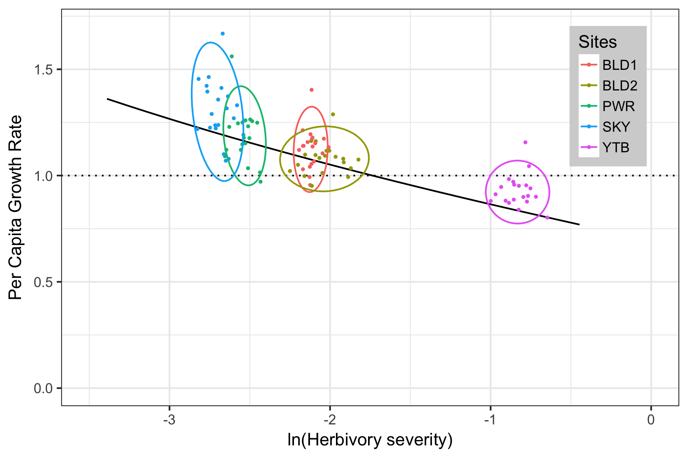

<h4 style="margin-top:1rem;">"Herbivory decreases population growth of common milkweed (Asclepias syriaca) through negative effects on clonal reproduction"</h4>
*by Sivan S. Yair, Abigail A. R. Kula, M. Drew LaMar, and Harmony J. Dalgleish*

<a href="https://mdlama.github.io/milkweed-yair/" class="mybtn">
Visit website
</a>
